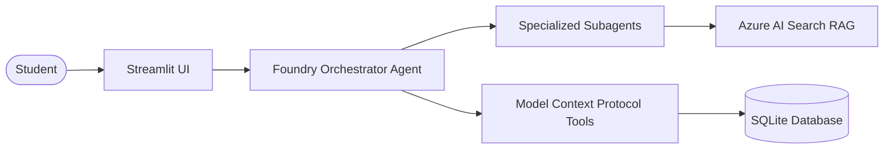

# 🎓 AI Placement Preparation Agent

[](https://github.com/Jiya-garg08/ai-placement-agent/actions)
[](https://www.python.org/downloads/)
[](https://streamlit.io/)
[](https://www.sqlalchemy.org/)
[](https://modelcontextprotocol.io/)
[](https://opensource.org/licenses/MIT)

> An intelligent, end-to-end placement acceleration platform that analyzes candidate profiles, extracts skills from resumes and job descriptions, conducts diagnostic assessments, computes structured skill gaps, builds personalized learning roadmaps, provides grounded RAG tutoring, evaluates performance, and continuously recommends the **Next Best Action**.

---

## 🏛️ System Architecture

The application adopts a **clean, decoupled architecture** that strictly separates deterministic business logic from probabilistic AI reasoning:



### Key Pillars
1. **Frontend**: Streamlit multi-page interface tracking the 8 stages of placement prep.
2. **AI Orchestration**: Microsoft Foundry Agent with specialized subagents (Resume, Assessment, Skill Gap, Planner, Tutor, Evaluation, Next Best Action).
3. **Database**: SQLite with SQLAlchemy ORM (architected for 1-click migration to PostgreSQL).
4. **Tool Access**: Model Context Protocol (MCP) server providing sandboxed database operations.
5. **RAG Pipeline**: Azure AI Search indexing curated university-grade curriculum across 10 technical domains with strict inline source citations.
6. **Budget Control**: Strict $200 Azure credit safeguard with offline mock modes for 100% free local development.

---

## 🚀 Quickstart Guide (Local Development)

### 1. Clone & Setup Virtual Environment
```bash
git clone https://github.com/Jiya-garg08/ai-placement-agent.git
cd ai-placement-agent

# Create and activate virtual environment
python -m venv .venv
# On Windows:
.venv\Scripts\activate
# On Linux/macOS:
source .venv/bin/activate

# Install dependencies
pip install -r requirements.txt
```

### 2. Configure Environment
```bash
cp .env.example .env
```
> **Tip**: `AZURE_MOCK_MODE=True` is enabled by default in `.env.example`. This allows you to test the entire system without incurring any Azure charges.

### 3. Run Automated Tests
```bash
pytest tests/ -v
```

### 4. Launch Streamlit Application
```bash
streamlit run app/streamlit_app.py
```

---

## 📋 The 8-Stage Placement Preparation Journey

1. **Student Onboarding**: Capture college, graduation year, target role, and baseline skills.
2. **Resume & JD Analysis**: Automated parsing of PDF/DOCX resumes and structured JD entity extraction.
3. **Diagnostic Assessment**: Calibrated 10-question technical quiz to measure actual concept depth.
4. **Skill Gap Engine**: Deterministic matrix comparison identifying *Strong*, *Weak*, and *Missing* competencies.
5. **Personalized Learning Plan**: Chronological week-by-week preparation roadmap with daily goals.
6. **Learning + Practice (RAG)**: Grounded conversational tutor referencing verified textbook materials with citations.
7. **Performance Evaluation**: Topic mastery scorecard, accuracy trends, and velocity tracking.
8. **Next Best Action**: Empirically computed single highest-priority task to tackle next.

---

## 🛠️ GitHub Issue-Driven Development

Every phase of this project is developed through discrete GitHub Issues:
- **Phase 0**: Project Foundation & Setup (Issue #01)
- **Phase 1**: Database & Student Onboarding (Issues #02, #03)
- **Phase 2**: Resume/JD Analysis Engine (Issues #04, #05, #06)
- **Phase 3**: Diagnostic Assessment & Question Bank (Issues #07, #08)
- **Phase 4**: Skill Gap Matrix Engine (Issue #09)
- **Phase 5**: Adaptive Learning Planner Agent (Issue #10)
- **Phase 6**: RAG Knowledge Base & Retrieval (Issues #11, #12, #13, #14)
- **Phase 7**: MCP Tool Layer (Issues #15, #16, #17)
- **Phase 8**: Microsoft Foundry Orchestration (Issues #18, #19)
- **Phase 9**: Interactive Practice Engine (Issue #20)
- **Phase 10**: Performance Evaluation (Issue #21)
- **Phase 11**: Next Best Action Engine (Issue #22)
- **Phase 12**: Streamlit Multi-Page UI (Issues #23, #24)
- **Phase 13**: Automated Testing & Security Hardening (Issues #25, #26)
- **Phase 14**: Containerization & Documentation (Issues #27, #28)

---

## 💰 Azure Budget & Cost Containment ($200 Cap)

To prevent budget exhaustion:
* **Phases 0–5**: 100% Free / Local development using SQLite and local test mocks ($0.00 spent).
* **Phase 6**: Azure AI Search indexing runs once with vector embeddings cached locally.
* **Phase 8**: Microsoft Foundry agents use `gpt-4o-mini` with token caps and local response caching.
* **Teardown guardrails**: Scripted monitors ensure spend stays within ~$17.26 total, reserving >90% of the $200 grant.

---

## 📄 License
This project is licensed under the MIT License - see the [LICENSE](LICENSE) file for details.
