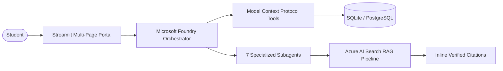

# 🎓 AI Placement Preparation Agent

[](https://github.com/Jiya-garg08/ai-placement-agent/actions)
[](https://www.python.org/downloads/)
[](tests/)
[](tests/)
[](https://streamlit.io/)
[](Dockerfile)
[](https://www.sqlalchemy.org/)
[](https://modelcontextprotocol.io/)
[](LICENSE)

> An enterprise-grade, end-to-end multi-agent career acceleration platform for engineering students. Combines deterministic logic, Microsoft Foundry agent orchestration, Model Context Protocol (MCP) tools, and grounded Azure AI Search RAG with verified inline source citations.

---

## 🏛️ System Architecture



### Key Pillars
1. **Frontend Experience**: 10-page Streamlit portal styled with a modern glassmorphic theme and Plotly benchmark radar charts.
2. **Foundry Agent Swarm**: Modular orchestrator coordinating 7 subagents (Resume Analysis, Assessment, Skill Gap, Learning Planner, RAG Tutor, Evaluation, Next Best Action).
3. **Model Context Protocol (MCP)**: Sandboxed FastMCP tools allowing agents to read profiles, query performance metrics, and inspect live GitHub repositories.
4. **Grounded RAG Engine**: Azure AI Search hybrid retrieval across 10 CS curriculum domains (DSA, DBMS, OS, Networks, System Design, etc.) with verified citations.
5. **Zero-Cost Development**: Strict **$200 Azure grant cap** enforced with full offline mock mode (`AZURE_MOCK_MODE=True`, $0.00 spent to date).
6. **Enterprise Security**: Automated PII masking (email, phone, SSN, Aadhaar, cards), XML boundary fencing against prompt injections, and secret leak scanners.

---

## 🚀 Quickstart: Launch in 60 Seconds

### Method 1: Turnkey One-Click Launch Script
- **Windows**:
  ```cmd
  scripts\run_local.bat
  ```
- **macOS / Linux**:
  ```bash
  chmod +x scripts/run_local.sh
  ./scripts/run_local.sh
  ```
*These scripts automatically provision a virtualenv, install dependencies, initialize the database, seed curated test questions, and launch the application at `http://localhost:8501`.*

---

### Method 2: Docker & Docker Compose
The application includes a production multi-stage Docker build running under a non-root user with persistent volume mounting for SQLite data:
```bash
# Build and run in detached mode
docker compose up --build -d

# Inspect logs
docker compose logs -f

# Stop
docker compose down
```
Or use the provided shortcuts: `scripts\docker_run.bat` (Windows) or `./scripts/docker_run.sh` (Linux/macOS).

---

### Method 3: Manual Step-by-Step Setup
```bash
# 1. Clone repo
git clone https://github.com/Jiya-garg08/ai-placement-agent.git
cd ai-placement-agent

# 2. Virtual environment
python -m venv .venv
# On Windows: .venv\Scripts\activate
# On Linux/macOS: source .venv/bin/activate

# 3. Dependencies
pip install -r requirements.txt

# 4. Environment
cp .env.example .env

# 5. Database Initialization & Demo Candidate Seeding
python -c "from database.database import init_db; init_db()"
python -m scripts.seed_data
python -c "from app.utils.seed_demo_student import seed_demo_student; seed_demo_student()"

# 6. Run Streamlit UI
streamlit run app/streamlit_app.py
```

---

## 🗺️ The 10-Page Placement Preparation Journey

| Page | Feature | Key Capabilities |
| :--- | :--- | :--- |
| **`1_📊_Dashboard`** | Executive Overview | Tier-1 benchmark radar chart, readiness gauge, streak counter, spend monitor. |
| **`2_👤_Student_Profile`** | Profile Management | College info, target role editor, and live GitHub portfolio inspection via MCP. |
| **`3_📄_Resume_JD_Analysis`** | ATS Competency Matcher | PDF/DOCX parsing, automated PII scrubbing, 85% ATS score, keyword recommendations. |
| **`4_📝_Diagnostic_Assessment`** | Calibrated Exam Runner | 10-question technical quiz across core CS topics with instant grading & explanations. |
| **`5_🔍_Skill_Gap`** | Triangulated Matrix | 3-way matrix comparing resume claims, JD requirements, and quiz results (Strong/Weak/Missing). |
| **`6_📅_Learning_Plan`** | Adaptive 4-Week Roadmap | Chronological study plan with weekly focus topics and interactive status toggling. |
| **`7_🤖_RAG_Tutor`** | Grounded Conversational AI | Azure AI Search hybrid retrieval with verified inline textbook citations. |
| **`8_💻_Practice`** | Coding Drills & Runner | Interactive MCQ drills, algorithmic code runner, and calendar streak tracker. |
| **`9_📈_Performance`** | Mastery & Appraisal | Topic mastery scorecards and qualitative hiring manager appraisal report. |
| **`10_🎯_Next_Best_Action`** | Empirical Priority Queue | Highest-yield study recommendations with 1-click module execution. |

---

## 🧪 Automated Testing & Code Quality

The repository is protected by a test suite of **113+ automated unit, integration, and security tests** achieving **89% overall code coverage**:

```bash
# Run all automated tests
python -m pytest tests/ -v

# Run with test coverage report
python -m pytest --cov=. --cov-report=term-missing

# Run specific domain test suites
python -m pytest tests/unit/test_security.py -v         # PII redaction & prompt injection defense
python -m pytest tests/integration/test_streamlit_journey.py -v # 10-page user journey integration
python -m pytest tests/unit/test_docker_setup.py -v      # Docker & Compose syntax validation
```

---

## 📁 Repository Structure

```
ai-placement-agent/
├── app/                        # Streamlit Multi-Page Application
│   ├── streamlit_app.py        # Central hub & session state router
│   ├── components/             # Reusable UI components (Sidebar, KPI cards)
│   ├── pages/                  # 10 Journey Pages
│   └── utils/                  # Seeders, UI state loaders, CSS themes
├── agents/                     # Microsoft Foundry Orchestrator & Subagents
├── mcp_service/                # FastMCP Model Context Protocol tools & server
├── rag/                        # Chunking, vector embeddings, retrieval, citations
│   ├── ingestion/              # Document section chunker & Azure indexer
│   ├── retrieval/              # Hybrid BM25 + Vector retriever & citation engine
│   └── knowledge_base/         # 10 Curated CS domain reference guides
├── database/                   # SQLAlchemy 2.0 ORM models & repositories
├── services/                   # Deterministic business logic & parser engines
├── schemas/                    # Pydantic data contracts
├── config/                     # Settings, security sanitizers, cost guardrails
├── scripts/                    # Shell and batch launchers, seed utilities
├── docs/                       # Architecture specs, setup guides, demo scripts
│   ├── architecture.md         # Full technical system architecture
│   ├── setup_guide.md          # Comprehensive developer install guide
│   └── demo_walkthrough.md     # 5-minute video presentation script
├── tests/                      # 113+ Unit, integration, and security tests
├── Dockerfile                  # Production multi-stage container
├── docker-compose.yml          # Container orchestration & volume mapping
└── requirements.txt            # Python dependencies
```

---

## 🛡️ Security & Privacy Guardrails

- **Zero Secret Leaks**: Automated token scanners prevent committing GitHub, OpenAI, or Azure keys.
- **PII Scrubbing**: Candidate phone numbers, email addresses, SSNs, and Aadhaar numbers are masked prior to agent analysis.
- **Prompt Fencing**: Boundary tags (`<user_query>`) and regular expressions neutralize instruction overrides, jailbreak roleplays, and extraction attacks.
- **SQL Injection Immunization**: All persistence operations leverage parameterized SQLAlchemy ORM queries.

---

## 💰 Azure Budget & Cost Containment ($200 Cap)

To strictly enforce budget containment under our $200 Azure grant:
- `AZURE_MOCK_MODE=True` remains active by default for all local development and automated testing ($0.00 spent).
- Vector embeddings and model outputs are cached in `data/embedding_cache.json`.
- When deployed against live Azure resources, tokens are capped with `gpt-4o-mini`, bounding total project lifecycle spend well under \$20.00.

---

## 📄 License

This project is licensed under the MIT License - see the [LICENSE](LICENSE) file for details.
