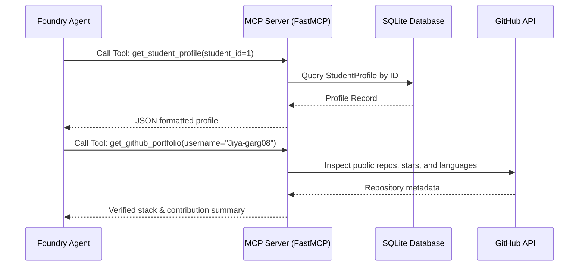
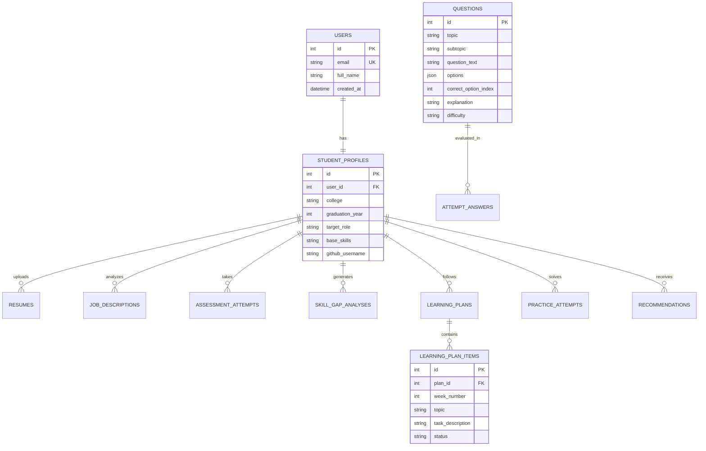
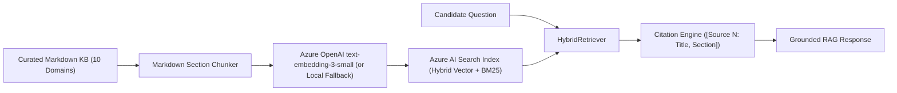

# 🏛️ AI Placement Preparation Agent: System Architecture & Technical Specification

## 1. Executive Architecture Overview

The **AI Placement Preparation Agent** is an enterprise-grade, multi-agent AI platform built to accelerate college engineering students through technical interview and placement readiness. The system couples deterministic software engineering practices (strictly validated schemas, relational integrity, deterministic scoring heuristics, and PII masking) with probabilistic agent reasoning (Microsoft Foundry agent orchestrator, domain subagents, Model Context Protocol tools, and grounded Azure AI Search RAG).

```mermaid
graph TB
    subgraph Client Layer [User Experience]
        UI["Streamlit Multi-Page Portal (Port 8501)"]
        Dashboard["1. Dashboard & Benchmark Radar"]
        Profile["2. Profile & GitHub Sync"]
        ResumeJD["3. ATS Resume/JD Engine"]
        Diagnostic["4. Calibrated Assessment"]
        SkillGap["5. Triangulated Matrix"]
        Roadmap["6. 4-Week Adaptive Planner"]
        Tutor["7. Grounded RAG Tutor"]
        Practice["8. Interactive Practice Drills"]
        Evaluation["9. Performance Analytics"]
        NextAction["10. Next Best Action Engine"]
    end

    subgraph Agent Swarm Layer [Microsoft Foundry]
        Orchestrator["Placement Orchestrator Agent"]
        A_Resume["Resume Analysis Subagent"]
        A_Assessment["Assessment Generation Subagent"]
        A_SkillGap["Skill Gap Triangulation Subagent"]
        A_Planner["Learning Planner Subagent"]
        A_Tutor["Grounded RAG Tutor Subagent"]
        A_Eval["Evaluation & Appraisal Subagent"]
        A_NBA["Next Best Action Subagent"]
    end

    subgraph Tooling Layer [Model Context Protocol - MCP]
        MCPServer["MCP Tool Server (FastMCP Standard)"]
        Tool_Profile["StudentProfileTool (Read/Write)"]
        Tool_Progress["ProgressPerformanceTool"]
        Tool_Plan["LearningPlanTool"]
        Tool_GitHub["GitHubPortfolioTool (Repo & Stack Sync)"]
    end

    subgraph Knowledge & Retrieval Layer [Azure RAG]
        Embeddings["Azure OpenAI text-embedding-3-small / Mock Vector Engine"]
        SearchIndex["Azure AI Search (Hybrid BM25 + Vector KNN)"]
        KnowledgeBase[("10 Academic Domains: DSA, OS, DBMS, Networks, System Design, etc.")]
        Citations["Citation Verification Engine"]
    end

    subgraph Storage & Persistence Layer
        DB[("Relational Database: SQLite (Dev) / PostgreSQL (Prod)")]
        Cache[("Local Embedding & Response Cache")]
    end

    UI --> Orchestrator
    Orchestrator --> A_Resume
    Orchestrator --> A_Assessment
    Orchestrator --> A_SkillGap
    Orchestrator --> A_Planner
    Orchestrator --> A_Tutor
    Orchestrator --> A_Eval
    Orchestrator --> A_NBA

    Orchestrator --> MCPServer
    MCPServer --> Tool_Profile
    MCPServer --> Tool_Progress
    MCPServer --> Tool_Plan
    MCPServer --> Tool_GitHub

    Tool_Profile --> DB
    Tool_Progress --> DB
    Tool_Plan --> DB

    A_Tutor --> SearchIndex
    KnowledgeBase --> Embeddings --> SearchIndex
    SearchIndex --> Citations --> A_Tutor
```

---

## 2. Core Subsystems

### 2.1 Microsoft Foundry Agent Swarm
The system uses an orchestrator-subagent hierarchy modeled on Microsoft Foundry patterns:
1. **Orchestrator Agent**: Inspects user intent via `IntentRouter`, tracks multi-turn conversational session states, routes domain queries to specialized subagents, and invokes MCP tool bindings.
2. **Resume Analysis Agent**: Extracts candidate competencies from uploaded PDF/DOCX resumes, segments structured sections (Education, Skills, Experience, Projects), and evaluates alignment against target Job Descriptions with ATS scoring.
3. **Assessment Agent**: Evaluates 10-question technical diagnostic exams across computer science topics, computing percentage scores, difficulty distributions, and detailed concept explanations.
4. **Skill Gap Agent**: Performs 3-way matrix triangulation comparing resume declarations, job description requirements, and diagnostic test results to classify competencies as *Strong*, *Weak*, or *Missing*.
5. **Adaptive Learning Planner Agent**: Synthesizes identified weaknesses into a chronological 4-week preparation roadmap with actionable daily targets and estimated hour allocations.
6. **RAG Tutor Agent**: Answers conceptual questions using grounded Azure AI Search retrieval over curated textbook knowledge, ensuring strict inline source citations and rejecting out-of-domain queries.
7. **Evaluation Agent**: Analyzes candidate practice history, learning velocity, and topic mastery to produce qualitative hiring manager appraisal reports.
8. **Next Best Action Agent**: Computes an empirical priority queue to recommend the single most impactful study task for the candidate to undertake next.

---

## 3. Model Context Protocol (MCP) Architecture

Tools are exposed through the standard **Model Context Protocol (MCP)** specification:

### Registered MCP Tools
- `get_student_profile`: Retrieves candidate profile, college, target role, and base skills.
- `update_target_role`: Updates candidate target placement role.
- `get_student_performance_summary`: Fetches diagnostic scores, total practice attempts, and accuracy.
- `get_active_learning_roadmap`: Retrieves active 4-week roadmap items and statuses.
- `mark_roadmap_item_status`: Sets roadmap task status (`PENDING`, `IN_PROGRESS`, `COMPLETED`).
- `get_github_portfolio`: Live inspection of GitHub repositories, primary languages, and star metrics.

---

## 4. Relational Database Schema

The persistence layer is implemented with **SQLAlchemy 2.0 ORM**, using SQLite for zero-setup local development and fully compatible with cloud-native PostgreSQL for production deployments.

---

## 5. RAG Pipeline & Grounded Knowledge Retrieval

### Retrieval Guarantees
1. **Zero Hallucination Grounding**: Responses are synthesized strictly from retrieved top-$k$ chunks.
2. **Explicit Inline Citations**: Formats citations in standard academic format: `[Source N: <Document Title>, <Section>]`.
3. **Out-of-Domain Guard**: If a query is unrelated to technical placement topics, the agent safely declines to answer.

---

## 6. Security Architecture & Zero Credential Leaks

1. **PII Sanitization**:
   - `redact_pii()` automatically masks candidate email addresses, international and Indian phone numbers, SSNs, 12-digit Aadhaar IDs, 16-digit credit card numbers, and IPv4 addresses.
2. **Prompt Injection Defense**:
   - Boundary fencing (`<user_query>...</user_query>`) wraps all candidate inputs.
   - Regex filtering identifies and neutralizes instruction overrides (`ignore previous instructions`), roleplay exploits (`DAN`, `developer mode`), and system prompt extraction attacks.
3. **Zero Committed Secrets Defense**:
   - Automated token regex scanner detects accidental exposures of GitHub PATs, OpenAI API keys, Azure secrets, and private RSA keys.
   - All SQL operations strictly use parameterized SQLAlchemy queries, immunizing against SQL injection attacks.

---

## 7. Cost Containment Architecture ($200 Grant Cap)

To strictly prevent budget exhaustion:
- **`AZURE_MOCK_MODE=True`**: Enforced default configuration across local and CI testing. Emulates embedding vectors, search ranking, and LLM responses with deterministic fixtures ($0.00 spent).
- **Embedding Cache**: Computed text embeddings are saved to `data/embedding_cache.json`, preventing redundant Azure embedding calls.
- **Token Caps**: In live cloud mode, completions are capped to `gpt-4o-mini` with strict `max_tokens` limits.
