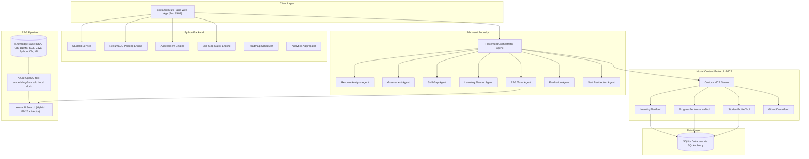

# AI Placement Preparation Agent: System Architecture & Technical Specification

## Overview
The **AI Placement Preparation Agent** is an end-to-end multi-agent system designed to guide engineering students through career placement preparation. It combines deterministic business logic (for parsing, scoring, matrix comparison, and database integrity) with AI orchestration (using Microsoft Foundry Agents, Azure OpenAI, and Model Context Protocol) and grounded knowledge retrieval via Azure AI Search RAG.

---

## 1. High-Level Architecture

---

## 2. Component Directory Layout
- `app/`: Streamlit front-end with 10 dedicated pages for every step of the candidate lifecycle.
- `agents/`: Microsoft Foundry Agent Orchestrator and specialized subagents.
- `rag/`: Document chunking, embedding generation, Azure AI Search indexing, hybrid retrieval, and citation verification.
- `mcp/`: FastMCP-based tool definitions providing sandboxed database operations.
- `database/`: SQLAlchemy 2.0 ORM models and clean repository abstractions.
- `services/`: Deterministic business logic (scoring, set operations, file sanitization).
- `schemas/`: Pydantic schemas validating all data flows across agents and tools.
- `config/`: Centralized settings loaded via Pydantic BaseSettings.
- `tests/`: Automated unit and integration test suites with offline mock mode.
